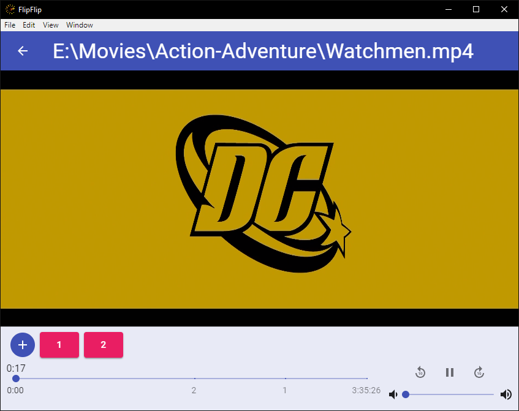

# Video Clipper

Often, you may only want to play _part(s)_ of a video rather than the whole thing. Rather than being forced to edit
each video, the "Video Clipper" allows you to curate "clips" from a video source which you can opt to use in your scenes.

To get started, create a video source (either in a Scene or in the Library). **NOTE:** This **_MUST_** be a direct
video URL (local or remote). 

Then, click the  
next to the source to go to the "Video Clipper" interface:

 

To create a new clip, click the `+`. To edit/view an existing clip, just click its number.

A slider will appear allowing you to select the start and end of this clip. You can also enter/modify the timestamp
directly for more precise selection. Double click "Start" or "End" to set it to the player's current timestamp.

* Click  to save changes to 
this clip.
* Click  to remove this clip.
  * _This only appears for saved clips._
* Click  to cancel changes.

While Clipping use Space to play/pause and use ← → to jump back/foward in 10sec intervals. Use `[` and `]` to jump to 
Clipping the previous/next visible video in the Library.  

?> Note: If clips don't seem to be working, ensure that "Play Selected Clips" is enabled for your scene (otherwise, 
it will play from the entire video).