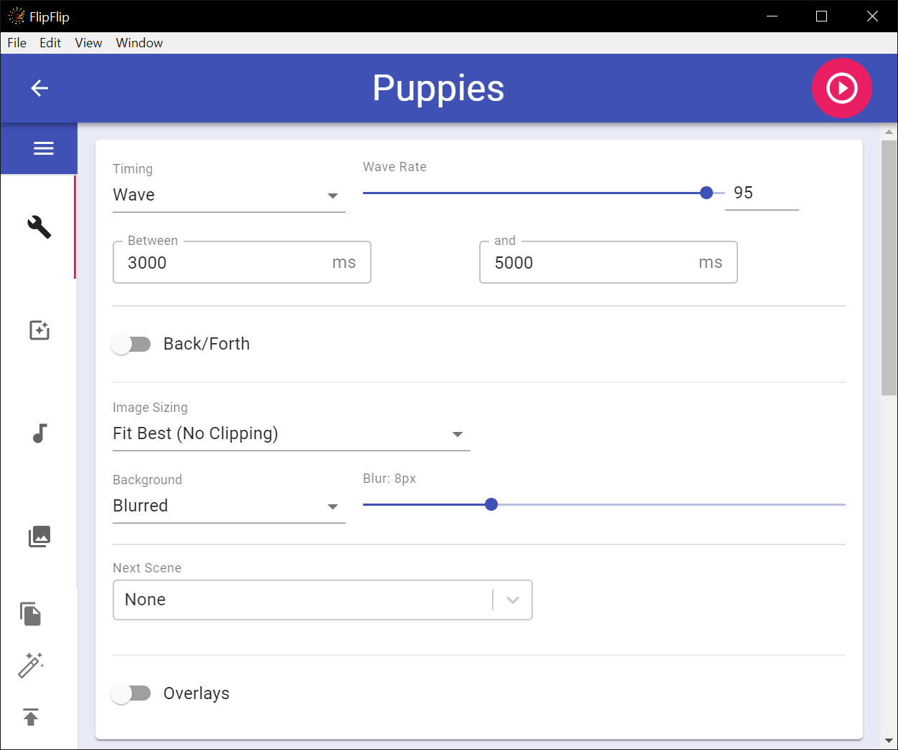

# Options
The **OPTIONS** tab provides a number of ways to control the Scene playback and what images will display. This tab
has two cards: `Scene Options` and `ImageOptions` 

## Scene Options

#### Timing
This setting controls the **rate at which images will change**. The rate can be **constant**, **random**, a **wave**, 
or based on **audio BPM**.
* **Constant**: Changes at a set interval
* **Random**: Changes at a random interval between min & max (ms)
* **Wave**: Changes at sin wave between min & max (ms).
  * You can modify the rate of change as well. _95-100 is generally recommended_ 
* **BPM**: Changes at the rate of the BPM of the first audio file
  * You can change the BPM multiplier to increase/decrease this rate.

_An example of **Wave** timing_
  
#### Image Sizing
This setting controls the aspect ratio and size of the displayed image:
* **Fit Best (No Clipping)**
* **Fit Best (Clip Edges)**
* **Stretch**
* **Center**
* **Fit Width**
* **Fit Height**

#### Background
This setting controls the background for this Scene:
* **Blurred** - Control the blur amount
* **Solid Color** - Control the background color
* **None**

#### Next Scene
Choose a Scene to transition to after this one (or none). Control the timing of the Next Scene (sec).

?> The "Next Scene" will pre-load in the background and start after the configured time has passed. Options, effects, 
audio/text, etc. will also change as configured.

#### Overlay
Add Scene(s) to overlay over this one (or none). Control each overlay opacity.

?> There is no limit to the number of scenes you can use with grid/overlay, 
but you may experience poor performance if you use too many.

## Image Options

#### Image Filter
This setting controls which images will display:
* **All Images**
* **Only Video**
* **Only Animated** - Videos _and_ Animated GIFs
* **Only Stills**

#### GIF Options
This setting overrides Scene timing specifically for animated GIFs.
* **No Change** 
* **Play Part** - Play GIFs for a certain length
* **Play Full**

#### Video Options
This setting overrides Scene timing specifically for videos.
* **No Change** 
* **Play Part** - Play videos for a certain length
* **Play Full**

Videos also have a number of other settings:
* **Start at Random Time** - Starts videos at a random timestamp (videos start from beginning by default).
* **Continue Videos** - Continue videos from last timestamp during this slideshow (videos restart by default).
* **Use Clips** - Choose to use only [video clips](clips.md) or the entire video.
  * If you are not using video clips, you can choose to skip the first and last parts of each video (ms)
* Control **video volume** for this scene.

#### Weighting
This setting controls how the images are weighted.
* **By source** - each source will be used an even amount (regardless of number of pictures).
* **By image** - each image will be used an even amount (regardless of source).
  
#### Ordering
This setting controls the order images will appear.
* **Strictly Ordered**
* **Ordered**
* **Randomized**

?> Typically, FlipFlip will show images in the order they load. However, *strictly ordered* will force
FlipFlip to wait for the next image to be ready before displaying.